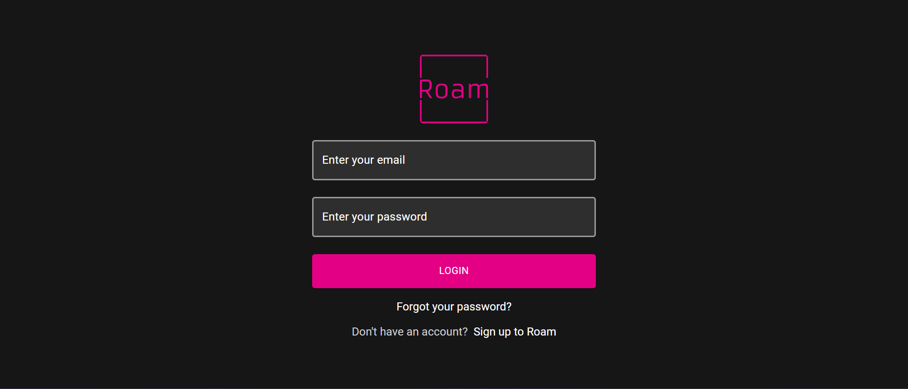
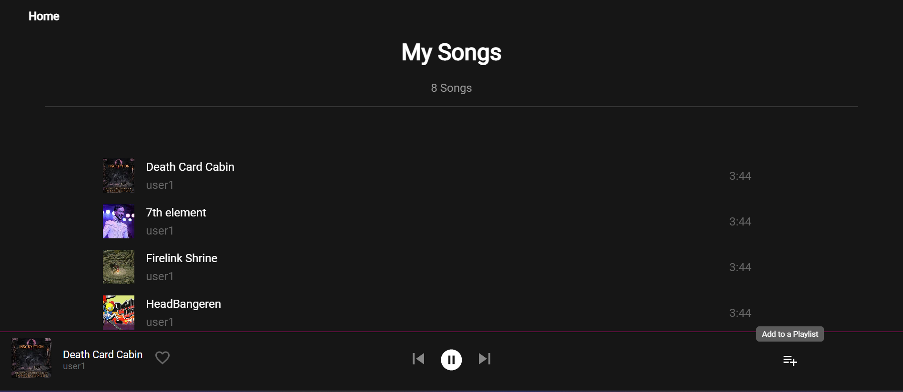

# Roam music player

## Lets you add and listen to songs, create playlists, search for songs added in the player and more

## [View the website live](https://music-player-roam.netlify.app/)

This is a mern stack project, built because I was always interested in trying to make a music player that lets you play audio files you upload 

<p align="center">
    
</p>

## Backend
- Backend was made keeping MVC pattern in mind 
- Made Models in Mongoose for Playlist, Song and User
- Then made routes for authentication (auth), playlist, song and user
- In auth made apis for registering and logging in users
- In playlist made apis for creating a playlist, getting playlists made by me, adding a song to a playlist and deleting a playlist
- In song made apis for creating a song, getting a song by name and getting all songs
- passport is used in routes in which the api calls should only be made by logged in users
- to run the backend 
```sh
nodemon index.js
```

## Frontend

<p align="center">
    
</p>

- A log in and sign up page that has checks to ensure that email is of proper format, and password is greater than 7 characters
- signing in takes you to the home page displayed above 
- from the home page you can go to see your songs collection, create a playlist, add a song or add a song 


<p align="center">
    
</p>


- the songs page shows you all the songs added by the user that is currently logged in
- when hovering on a song, clicking on the trash icon on the cards right end will delete the song


<p align="center">
    
</p>

- when hovering on a song, a play arrow becomes visible. Clicking on it will make the song play
- the bottom player in which the song is playing, stays there even when navigating across pages

<p align="center">
    
</p>

- from the home page we can also go to the create a playlist link
- this creates a modal that lets us enter a playlist name
- it also lets us enter a thumbnail for the playlist
- clicking on the create playlist button then creates it

<p align="center">
    
</p>

- from the home page we can also go to the search song page
- this lets us enter the name of a song added by any user and search for it
- it can also be played from there

  
<p align="center">
    
</p>


- from the home page we can also go to the upload song page
- this lets us enter a song name, followed by the desired thumbnail for the song
- we also have to enter the audio file for the respective song
- on clicking add song, a toastify notification should pop up on successfully uploading the song


<p align="center">
    
</p>

- when a song is playing, we can see a button on the bottom player for adding the song to a playlist
- clicking on it opens a modal

  <p align="center">
    
</p>

- this modal shows us all the playlists the logged in user has
- clicking on any of them adds the song to that playlist
