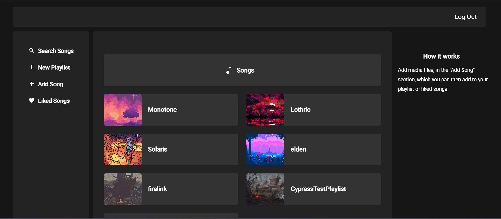

# Roam music player

## Lets you add and listen to songs, create playlists, search for songs added in the player and more

## [View the website live](https://music-player-roam.netlify.app/)

This is a mern stack project, built because I was always interested in trying to make a music player. The website was built using these steps

    

## Backend
